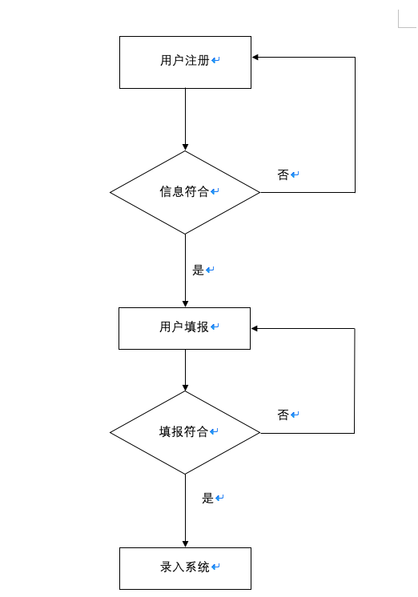

## 概要设计

  

### 1.引言

 

#### 1.1编写目的

 

本概要设计文档主要用来指导省人力资源市场数据采集系统的详细设计工作。为详细设计提供统一的参照标准，其中包括系统的内外部接口、系统框架、编程模型以及其他各种主要问题的解决方案。

在详细设计的过程中，如果发现需要添加新的概要设计标准或者约束来指导详细设计工作，必须在此文档进行更新和评审，一确保各模块详细设计的一致性和正确性。

本文档主要描述生人力资源市场数据采集系统的概要设计，其中包括定义系统的内外部接口、相关的系统框架和设计标准，不会设计系统业务逻辑实现的细节。

  

#### 1.2项目背景

  

#### 1.3定义

| 术语缩写 | 术语全称 | 中文翻译（供参考） |
| -------- | -------- | ------------------ |
|          |          |                    |

   

 

### 2.总体设计方案

  

按功能不同进行技术层次的划分，使各层功能相对独立。同时以接口形式来描述各层之间的调用关系，以达到层次之间的松散耦合。

以下为总体模块之间的关系：

 

 

#### 2.1设计前提和约束条件

 

1.系统用户登陆必须符合登陆用户名密码

2.用户需要实名认证

3.遵循编码规范

4.数据传递过程中需要注意安全发送与接收，以及需要对接收数据进行校验。

 

 

#### 2.2功能划分及流程处理

 

 

 

 

####2.3用户管理模块

 

##### 2.3.1功能概述

 

主要负责用户的创建，用户信息的填报录入。

##### 2.3.2流程

 

####2.4数据管理模块

 

##### 2.4.1功能概述

该模块主要负责管理数据相关的操作。其中，数据填报要根据预先设计的模版在规定范围内填报，填报完成后保存，确认无误后上报。支持查询

####2.5通知管理模块

####2.6报表管理模块

####2.7系统管理模块

