## 概要设计    

### 1.引言   

#### 1.1编写目的

 

本概要设计文档主要用来指导省人力资源市场数据采集系统的详细设计工作。为详细设计提供统一的参照标准，其中包括系统的内外部接口、系统框架、编程模型以及其他各种主要问题的解决方案。

在详细设计的过程中，如果发现需要添加新的概要设计标准或者约束来指导详细设计工作，必须在此文档进行更新和评审，一确保各模块详细设计的一致性和正确性。

本文档主要描述生人力资源市场数据采集系统的概要设计，其中包括定义系统的内外部接口、相关的系统框架和设计标准，不会设计系统业务逻辑实现的细节。

  

#### 1.2项目背景

此项目是为了实现国、省、市（县）级别的人力资源信息传递，服务于广大人民群众，方便国家及时统计全国劳务人员的信息。

 

### 2.总体设计方案

  

按功能不同进行技术层次的划分，使各层功能相对独立。同时以接口形式来描述各层之间的调用关系，以达到层次之间的松散耦合。

以下为总体模块之间的关系：

 

 

#### 2.1设计前提和约束条件

 

1.系统用户登陆必须符合登陆用户名密码

2.用户需要实名认证

3.遵循编码规范

4.数据传递过程中需要注意安全发送与接收，以及需要对接收数据进行校验。

 

 

#### 2.2功能划分及流程处理   

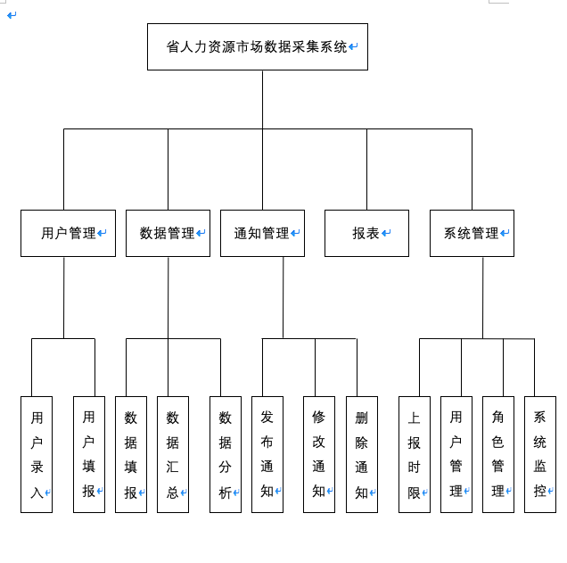

 

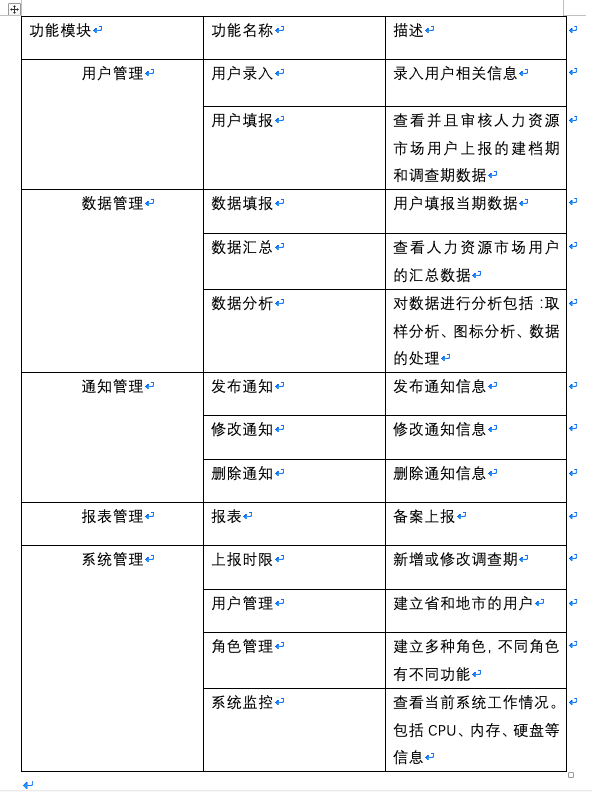

 

 

#### 2.3用户管理模块

 

##### 2.3.1功能概述

 

主要负责用户的创建，用户信息的填报录入。

 

##### 2.3.2流程

 

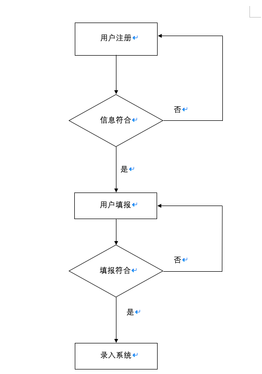

#### 2.4数据管理模块

 

##### 2.4.1功能概述

 

该模块主要负责管理数据相关的操作。其中，数据填报要根据预先设计的模版在规定范围内填报，填报完成后保存，确认无误后上报。支持查询(根据调查期查询填报信息)、保存（暂时保存填报信息，但不会上报，保存后还可以进行修改）、上报（上报后不能修改）等操作。

 

##### 2.4.2流程

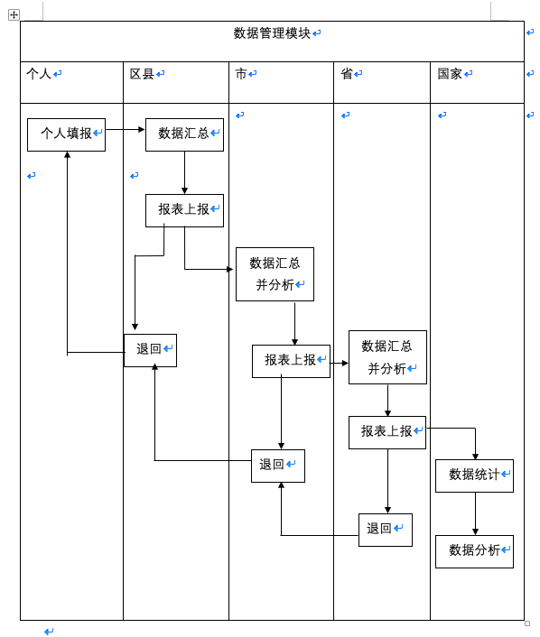

#### 2.5通知管理模块

 

##### 2.5.1功能概述

 

该模块主要负责发布、修改、删除通知信息。

 

#### 2.6报表管理模块

 

##### 2.6.1功能概述

 

该模块主要负责审核地市（区县）上报的数据，不合格的退回，合格的上报

 

##### 2.6.3流程

 

见2.4.2

​ 

#### 2.7系统管理模块

 

##### 2.7.1功能概述

 

该模块主要负责系统相关的功能，主要包括上报时限的修改，用户的管理、角色管理、系统监控等。
 

### 3.模块设计
 

#### 3.1功能模块层次图

 

#### 3.2结构图
 

### 4.接口设计 
 

#### 4.1外部接口 
 

##### 4.1.1硬件环境要求   
防火墙：百兆互联网防火墙，可以利用机房环境的防火墙设备。
应用服务器要求如下：CPU主频不低于2.8 GHz 的至强CPU、4GB内存、100G以上硬盘空间、支持Raid5。
备份服务器：建议利用托管机房环境的备份设备。
 

##### 4.1.2软件环境要求如下：
1.Windows 2003以上操作系统
2.Oracle 10G以上数据库
3.TOMCAT 6.0以上应用中间件
4.反病毒软件服务器版 
 

##### 4.1.3使用编程语言：JAVA 
 

##### 4.1.4使用框架：SSH
 

#### 4.2内部接口
本系统之内的各个系统模块素之间的接口的安排：

### 5.数据结构

##### 数据字典
|数据|数据类型|能否为空|默认值|
|----|-------|------|------|
|用户身份证号|GETCHAR(20)|NO|
|用户编码ID|GETCHAR(12)|NO
|联系人姓名|GETCHAR(10)|NO
|联系人手机|GETCHAR（20）|NO
|联系人电话|GETCHAR(15)|YES
|用户名|GETCHAR（12）|NO|USER
|用户密码|GETCHAR（12）|NO|000000|
|传真|GETCHAR(10)|YES|
|adminID|GETCHAR（20）|NO
|管理员用户名|GETCHAR(12) |NO
|管理员密码|GETCHAR(12) |NO
|管理员权限|UNSIGNEDINT|NO
|人力资源市场名|GETCHAR(12)|NO
|地区|GETCHAR(10)|NO
|行业编码|GETCHAR(10)|NO
|行业名称|GETCHAR(20)|NO
|行业需求人数|UNSIGNEDINT|NO
|性别|BOOL|YES|
|求职人员类别|GETCHAR(15)|NO
|职业类别|GETCHAR(15)|NO
|职业代码|UNSIGNEDINT|NO
|求职人员类别代号|UNSIGNEDINT|NO
|求职人员类别|GETCHAR(15)|NO
|产业代号|UNSIGNEDINT|NO
|产业类别|UNSIGNEDINT|NO
|产业名称|GETCHAR(15)|NO
|产业需求人数|UNSIGNEDINT|NO
|年龄|UNSIGNEDINT|NO
|文化程度|GETCHAR(20)|NO
|职业技术等级|GETCHAR(20)|NO

##### 1.用户编码信息
| 身份证号 | 用户编码ID | 联系人姓名 | 联系人手机|
| -------- | -------- | ---------|----|
| GETCHAR（20）| GETCHAR(12) |GETCHAR(10)|GETCHAR（20）|
 
说明：此表格用途仅为通知联系人其用户编码ID，采用身份证号来作为其键值，可以避免不法分子肆意篡改个人信息。只有用户自己可以知道自己的用户编码ID。

##### 2.用户登录账号
| 用户编码ID |用户名| 密码 | 是否上报数据 |
| -------- | ---|----- | ---------|
|   GETCHAR（20）| GETCHAR（12）  | GETCHAR(12)     |BOOL|
 
说明:此数据表为个人用户登录自己的账户时所使用到的账户。ID（身份证号）为键值，用以区分不同的用户。每个人的初始密码均为6位数000000，密码本身设置为GETCHAR（12）类型，ID为GETCHAR(20)类型。是否上报数据这一项是为了满足市级用户管理中的功能，具体功能为：如果该选项为TRUE，则该用户数据不能被删除，如果为FALSE，则该用户数据可以删除。

##### 3.管理员使用账户
|adminID  |  管理员用户名  | 管理员密码 | 权限 |
|----| -------- | -------- | ----|
|GETCHAR（20） |   GETCHAR(12)  | GETCHAR(12)   | UNSIGNEDINT |
 
说明：管理员使用账户保存的地方，用户名与密码不再赘述。权限为该管理员账户拥有的权限类型，用无符号整数来保存，若为“1”该账户为国家级账户管理员，若为“2”该账户为省级账户管理员，若为“3”该账户为市级账户管理员，若为“4”该账户为某一监测点的管理员账户。因为管理员账户没有设置初始账户，需要国家统筹规划增加管理员账户。ID为标识该账户的标志号，为键值。

##### 4.人力资源市场用户备案信息表
| 用户编码ID | 人力资源市场名|所属地区|联系人（中文）|联系人（英文）|联系人手机|联系电话|传真| 
| -----------  | ----------- | -------|-----|----------|-------|-----|-------|
| GETCHAR（20）| GETCHAR(12) |GETCHAR(10)|GETCHAR(10)|GETCHAR(10)|GETCHAR(20)|GETCHAR(15)|GETCHAR(10)|
 
说明：该选项为个人用户所需要等级的个人信息表，其中传真可以为空，其他选项均不能为空。键值为ID。

##### 5.市级用户管理表
| 用户名 | 密码|确认密码|用户编码|用户人姓名|所属地区|行业|
| -----  | ----| -------|------|----------|-------|-----|
| GETCHAR（12）| GETCHAR(12) |GETCHAR(12)|GETCHAR(20)|GETCHAR(10)|GETCHAR(10)|UNSIGNEDINT|
 
说明：此表为市级管理员在管理用户时使用到的表，键值为用户编码。其中行业为下拉方式的选择因为行业总体是有限的，可选值从表6中选择。

##### 6.行业编码与需求人数表
|行业对应编码|行业|需求人数|
|-----------|----|------|
|GETCHAR(10)|GETCHAR(20)|UNSIGNEDINT|
 
说明：此表为某一个行业对应的行业的编码是多少以及对应行业的需求人数为多少。键值为行业对应编码。

##### 7.职业类别与代码对应表
|职业代码|职业类别|
|-------|--------|
|UNSIGNEDINT|GETCHAR(15)|
 
说明：此表为某一职业类别与其职业代码对应的表，KEY值为职业代码。

##### 8.求职人员类别代号与类别对应表
|求职人员类别代号|求职人员类别|
|--------------|------------|
|UNSIGNEDINT|GETCHAR(15)|
 
说明：键值为求职人员类别代号。

##### 9.产业表
|产业代号|产业类型|产业名称|对应行业代码|产业需求人数|
|-------|--------|-------|------------|----------|
|UNSIGNEDINT|UNSIGNEDINT|GETCHAR(15)|UNSIGNEDINT|UNSIGNEDINT|
 
说明：key值为产业代号。此表说明了产业的具体代号、产业需求人数、产业对应的行业代码。

##### 10.用户等级信息表
|用户编码|性别|求职人员类别|职业代码|求职人员类别代号|年龄|文化程度|职业技术等级|
|-------|--------|----|-----------|---------------|---|------|---------------|
|GETCHAR(12)|BOOL|GETCHAR(15)|UNSIGNEDINT|UNSIGNEDINT|UNSIGNEDINT|GETCHAR(15)|GETCHAR(15)|
 
说明：用户在登录账号后填到的自己的信息，为最重要的信息表。其中性别选项可以为空，如果是男性则输入0，如果为女性输入1；

### 6.框架设计
采用目前业界成熟的SSH框架，在表示层利用SpringMVC框架实现前端，用spring实现业务逻辑层，用Mybatis实现数据访问层的内容

SSH框架可见下图
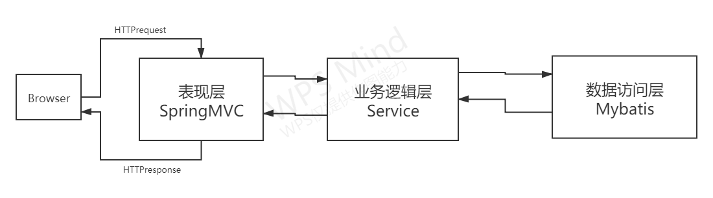

在最主要的表现层采用SpringMVC框架流程如下图所示
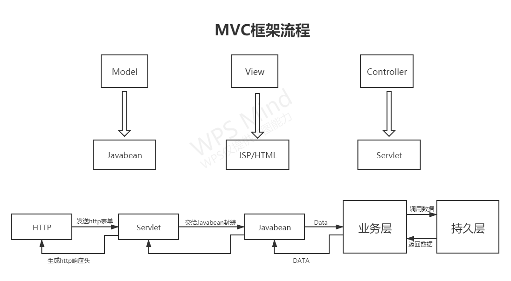

整体的框架如下图所示
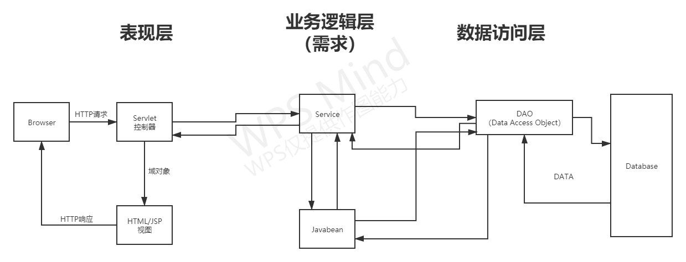

### 7.用户界面设计

#### 7.1用户登录界面
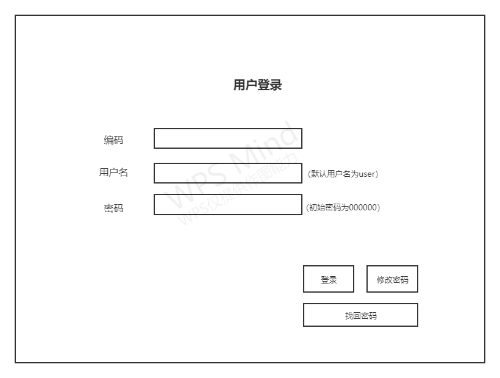

说明：编码为每个人独立拥有的统计编码号，每个人都不相同，用户名默认为user，初始密码为000000，点击修改密码可以修改自己的用户名以及密码信息。当用户第一次登录时用户名输入user，密码输入000000时即可正常登录，进去之后需要修改自身的用户名以及密码。用户名可以空着。

#### 7.2修改密码界面
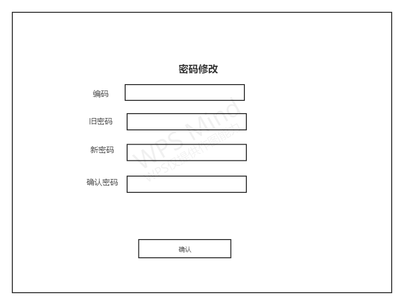
说明：页面为修改密码的页面。需要注意的是确认密码和新密码不是通过jsp文件确认，而是提交到远端进行确认来确保安全。如果两次密码输入不一致就会弹出响应的提醒。

#### 7.3找回密码界面
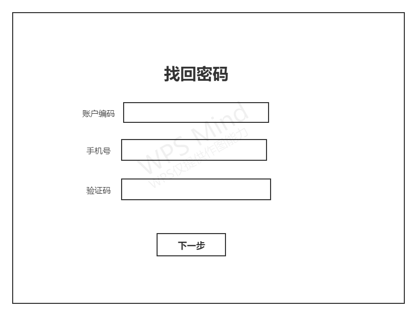
说明：找回密码页面需要用户输入自己的绑定手机号，然后往手机号上发送一个验证码，输入正确就会进行下一步，输入错误就会出现错误提示。

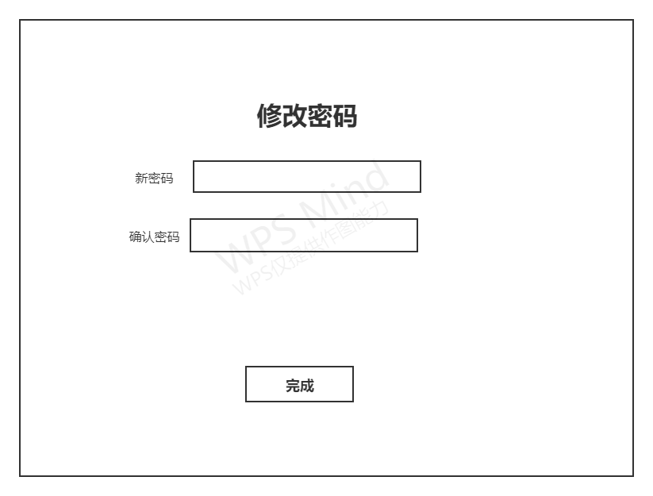
说明：用户验证正确后将会进入一个新的页面输入自己的新密码,按下完成后将会跳转到用户登录界面

#### 7.4用户填写数据界面

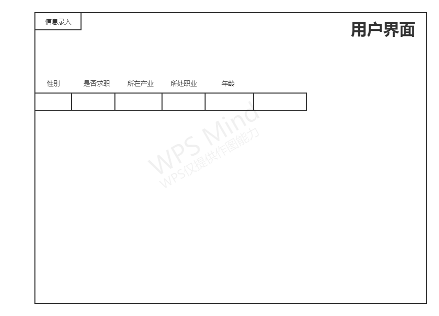
说明：在此页面中用户填录自己的相关信息。

#### 7.5管理员登录界面

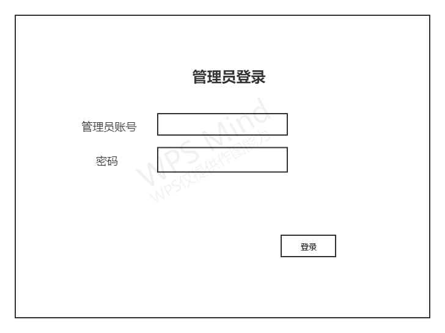
说明：管理员的账号和密码为国家统筹管理，因此不能修改密码和账户，只能通过国家给的固定账户与密码进行登录。登录后可以查看劳务人员相关数据。

#### 7.6管理员管理界面

说明：在此页面中可以根据管理员自身的权限不同，对不同的数据表进行增删改查。
### 8.安全设计
 

#### 8.1用户密码安全
具体内容：使用SHA-256等加密算法或者应用其他密码学相关知识来对用户密码传输时进行高度加密防止个人用户信息泄露；将个人用户的编号告知用户自身时如何防止用户信息因为其他原因被不法分子盗取。
#### 8.2服务器安全
具体内容：阻挡DDOS攻击等网络攻击
#### 8.3数据安全
具体内容：在用户填报完成数据并提交表单到后台后HTTP协议中的内容如何保密从而不会引起数据泄露。国家如何创建绝对安全的管理员账户以对付网络黑客导致的管理员账户被盗事件。
#### 8.4防火墙安全
具体内容：防止因病毒或者木马程序引起的防火墙被突破进而引发的用户数据泄露和管理员数据泄露
 
### 9.制定规范
 

#### 9.1java命名规范

1.1、项目名全部小写

1.2、包名全部小写

1.3、类名首字母大写，若类名由多个单词构成，每个单词首字母大写，即驼峰命名法

1.4、变量名、方法名首字母小写，若其由多个单词构成，每个单词首字母大写，即小驼峰命名法

1.5、常量名全部大写

1.6、名称只能由数字、字母、下划线、$符组成，不能以数字开头

1.7、尽量不要使用拼音 或者 英语掺杂拼音（如：StudentDianHua || MyHomeDiZhi 等）

 

#### 9.2前端命名规范

2.1、一律小写；

2.2、尽量用英文；

1.3、尽量不加中杠和下划线；

2.4、尽量不缩写，除非一看就明白的单词，如：wrapper可以写成wrap。

 

#### 9.3驼峰命名法：

3.1、小驼峰命名：

除第一个单词之外，其他单词首字母大写（常用于变量）

        var phoneNumber = 150xxxxxxxx;

3.2、大驼峰命名：（帕斯卡命名法）

        var Address = 'xx省xx市xx区xx路';